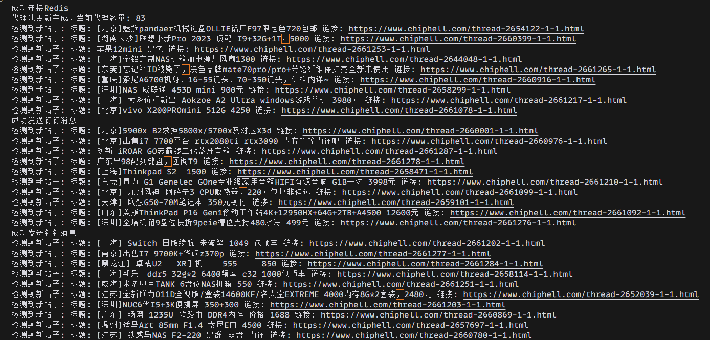
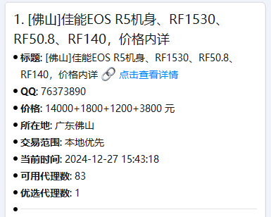
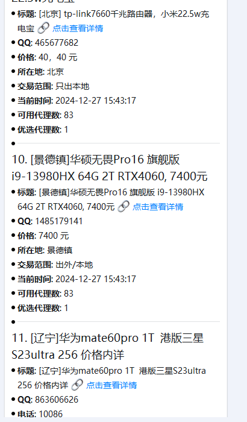

# Chiphell 二手区监控

[](https://github.com/langchou/informer)
[](https://github.com/langchou/informer/blob/main/LICENSE)

一个用于监控 Chiphell 论坛二手交易区的自动化工具。支持关键词匹配、钉钉通知等功能。

## 功能特点

- 🔍 实时监控二手交易区新帖
- 🎯 支持多关键词匹配
- 📱 钉钉机器人通知，支持@指定用户
- 🔄 智能代理池管理（内存存储）
- 🗃️ SQLite 本地持久化
- 🚫 智能去重和过滤
- 🐳 支持 Docker 部署

## 使用示例

### 运行效果

1. 程序运行日志


2. 钉钉通知效果
- 基础通知


- 详细通知（带商品信息）


通知说明：
- 基础通知：当无法获取详细信息时，仅显示标题和链接
- 详细通知：包含完整的商品信息（价格、地点、联系方式等）
- 支持@指定用户：根据关键词自动@相关用户

## 快速开始

### 使用 Docker Compose（推荐）

1. 创建配置文件

```bash
mkdir -p data build/data
touch data/config.yaml
```

2. 编辑 `data/config.yaml` 配置文件

```yaml
logconfig:
  file: "data/app.log"
  maxSize: 10
  maxBackups: 5
  maxAge: 30
  compress: true
  level: "info"

dingtalk:
  token: "your-token"
  secret: "your-secret"

# 代理池配置（可选）
proxyPoolAPI: ""  # 留空则不使用代理

# Chiphell配置
cookies: "your-cookies"
userKeyWords:
  "158********":  # 手机号用于@通知
    - "iphone"    # 关键词

waitTimeRange:  # 监控间隔（秒）
  min: 2
  max: 5
```

3. 启动服务

```bash
# 拉取最新镜像并启动服务
docker-compose up -d

# 查看日志
docker-compose logs -f
# 或
tail -f build/data/app.log
```

### 从源码构建（开发用）

如果您需要修改代码或进行开发，可以从源码构建：

1. 克隆仓库
```bash
git clone https://github.com/langchou/informer.git
cd informer
```

2. 修改 docker-compose.yml
```yaml
version: '3'

services:
  informer:
    build:
      context: .
      dockerfile: Dockerfile
    volumes:
      - ./data:/app/data
      - ./build/data:/app/build/data
    environment:
      - TZ=Asia/Shanghai
    restart: unless-stopped
```

3. 构建并启动
```bash
docker-compose build
docker-compose up -d
```

### 使用二进制文件

1. 下载最新版本

```bash
wget -O informer https://github.com/langchou/informer/releases/latest/download/informer-linux-amd64
chmod +x informer
```

2. 创建并编辑配置文件（同上）

3. 运行程序

```bash
./informer
```

## 配置说明

### 钉钉机器人配置

1. 创建钉钉机器人
   - 进入钉钉群 -> 群设置 -> 智能群助手 -> 添加机器人
   - 选择"自定义"机器人
   - 安全设置选择"加签"，记录下 token 和 secret

2. 配置文件说明
   - `token`: 钉钉机器人的 access_token
   - `secret`: 钉钉机器人的签名密钥
   - `userKeyWords`: 用户关键词配置，key 为手机号（用于@通知）

### 代理池配置（可选）

- `proxyPoolAPI`: 代理池API地址，留空则不使用代理
- 支持 HTTP 和 SOCKS5 代理

#### 代理池返回格式说明

代理池API返回格式为按行分隔的代理地址，例如：
```text
socks5://1.2.3.4:1080
http://5.6.7.8:8080
socks5://9.10.11.12:1080
```

### 日志配置

- `file`: 日志文件路径
- `maxSize`: 单个日志文件最大尺寸（MB）
- `maxBackups`: 保留的旧日志文件数量
- `maxAge`: 日志文件保留天数
- `compress`: 是否压缩旧日志
- `level`: 日志级别（debug/info/warn/error）

## 开发指南

### 环境要求

- Go 1.22+
- Make（可选）

### 本地开发

1. 克隆仓库

```bash
git clone https://github.com/langchou/informer.git
cd informer
```

2. 安装依赖

```bash
go mod tidy
```

3. 编译

```bash
make build
# 或
go build -o informer cmd/informer/main.go
```

## 最近更新

### v1.1.0 (2024-01-05)
- 移除 Redis 依赖，代理池改用内存存储
- 保留 SQLite 用于帖子信息持久化
- 优化代理池管理，支持按行分隔的代理格式
- 优化钉钉通知消息格式，提升可读性
- 添加 Docker 支持，简化部署流程
- 更新 Go 版本要求至 1.22

## 注意事项

1. Cookie 有效期
   - 定期更新 cookies 以确保正常访问
   - cookies 失效会导致监控失败

2. 代理使用
   - 建议在被限制访问时才启用代理
   - 确保代理池稳定可用

3. 系统资源
   - 注意日志文件大小
   - 定期清理数据库历史数据
   - 定期重启程序刷新代理池

## 免责声明

本工具仅用于学习和研究目的，请勿用于非法用途。使用本工具所产生的任何后果由使用者自行承担。
